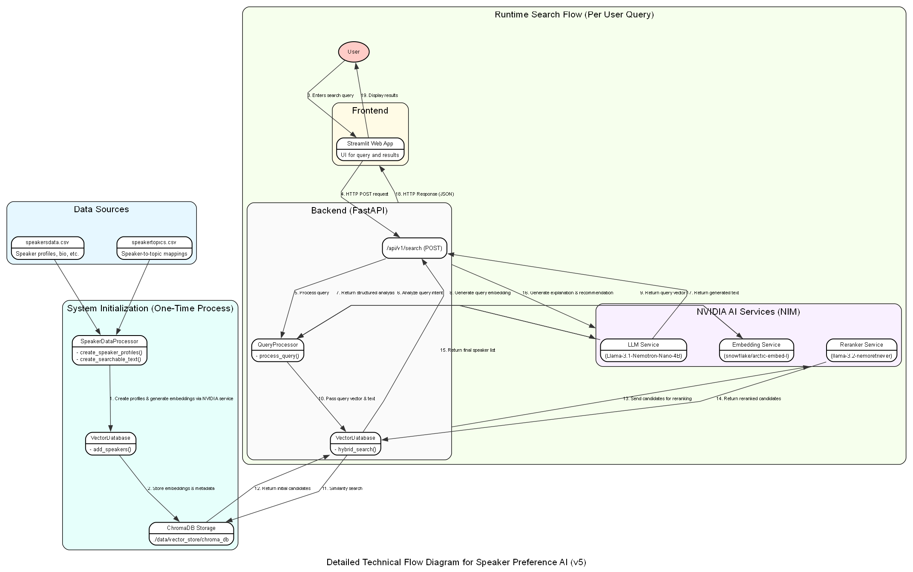

# Speaker Preference AI

This project is an advanced, AI-powered speaker search and recommendation system. It leverages a Retrieval-Augmented Generation (RAG) pipeline with local NVIDIA NIM services to provide a sophisticated, natural language interface for finding ideal speakers based on complex criteria.

## Technical Flow Diagram

The following diagram illustrates the complete end-to-end architecture and data flow of the application, from initial data processing to the final user-facing recommendation.



---

## Core Concepts

- **Retrieval-Augmented Generation (RAG):** The system doesn't rely solely on a Large Language Model (LLM) to answer queries. Instead, it first *retrieves* relevant information (speaker profiles) from a specialized data source (a vector database) and then uses the LLM to *augment* this data with explanations and recommendations. This approach ensures answers are grounded in factual data and reduces model "hallucinations."

- **Hybrid Search:** To achieve high-relevance retrieval, the system employs a multi-stage hybrid search:
    1.  **Vector Search:** A fast, semantic search that finds speakers based on the conceptual meaning of the user's query.
    2.  **Reranking:** A more sophisticated model then re-evaluates the initial results from the vector search, re-ordering them for maximum relevance to the original query text. This significantly improves the quality of the final recommendations.

- **NVIDIA NIM:** The project is powered by NVIDIA's Inference Microservices (NIM), which run locally. This provides a powerful, self-hosted alternative to cloud-based AI services, offering high performance and data privacy. The system uses three distinct NIMs:
    - **Embedding Model:** To convert text (speaker profiles and user queries) into numerical vector representations.
    - **Reranker Model:** To perform the crucial reranking step of the hybrid search.
    - **LLM:** For advanced reasoning, query analysis, and generating the final human-readable explanations.

---

## Project Structure

```
/
├── data/
│   ├── raw/
│   │   ├── speakersdata.csv      # Raw speaker profile data
│   │   └── speakertopics.csv     # Speaker-to-topic mappings
│   └── vector_store/
│       └── chroma_db/            # Persistent ChromaDB vector store
├── src/
│   ├── api/
│   │   ├── main.py               # FastAPI app entry point
│   │   └── routes.py             # API endpoint definitions (/search)
│   ├── core/
│   │   ├── data_processor.py     # Cleans, merges, and prepares data
│   │   ├── nvidia_services.py    # Client for all NVIDIA NIM interactions
│   │   ├── query_processor.py    # Analyzes and enriches user queries
│   │   └── vector_db.py          # Manages ChromaDB and hybrid search
│   └── web/
│       └── app.py                # Streamlit frontend application
├── configs/
│   └── dev.yaml                  # All application configuration
├── run_api.py                    # Script to start the FastAPI backend
├── run_web.py                    # Script to start the Streamlit frontend
├── test_*.py                      # Various test scripts
└── README.md                     # This file
```

---

## Setup and Installation

1.  **Clone the repository:**
    ```bash
    git clone <repository_url>
    cd <repository_directory>
    ```

2.  **Install Python dependencies:**
    It is recommended to use a virtual environment.
    ```bash
    python -m venv venv
    source venv/bin/activate  # On Windows use `venv\Scripts\activate`
    pip install -r requirements.txt
    ```

3.  **Set up NVIDIA NIM:**
    Ensure you have Docker installed and the NVIDIA Container Toolkit. Follow the official NVIDIA documentation to pull and run the required models specified in `configs/dev.yaml`.

4.  **Verify Configuration:**
    Review `configs/dev.yaml` to ensure all paths and model names match your local setup.

---

## How to Run

The application consists of two main components that must be run separately.

1.  **Start the Backend API:**
    Open a terminal and run:
    ```bash
    python run_api.py
    ```
    The API will be available at `http://localhost:8000`. You can view the auto-generated documentation at `http://localhost:8000/docs`.

2.  **Start the Frontend Web App:**
    Open a *second* terminal and run:
    ```bash
    python run_web.py
    ```
    The Streamlit application will be available at `http://localhost:8501`.

---

## API Endpoints

### `POST /api/v1/search`

This is the primary endpoint for searching for speakers.

-   **Request Body:**

    ```json
    {
      "query": "Find me an expert in cloud security for a technical audience",
      "max_results": 5
    }
    ```

-   **Success Response (200 OK):**

    ```json
    {
      "speakers": [
        {
          "speaker_id": "12345",
          "name": "Jane Doe",
          "job_title": "Principal Security Architect",
          "company": "SecureCloud Inc.",
          "speaking_topics": ["Cloud Security", "Zero Trust", "DevSecOps"],
          "bio": "Jane is a leading expert...",
          "similarity_score": 0.891,
          "rerank_score": 0.954
        }
      ],
      "explanation": "Based on your query, I found several experts in cloud security...",
      "recommendation": "For a technical audience, Jane Doe is the top recommendation due to her extensive experience...",
      "query_analysis": {
        "intent": "find expert speakers on cloud security for a technical audience",
        "technologies": ["cloud security"],
        "audiences": ["technical"]
      },
      "total_results": 5,
      "search_time_ms": 1234
    }
    ```

---

## Core Components Deep Dive

### `SpeakerDataProcessor`

This class is responsible for the entire Extract, Transform, Load (ETL) process.

-   **Workflow:**
    1.  `load_data()`: Reads the raw CSV files (`speakersdata.csv`, `speakertopics.csv`).
    2.  `merge_data()`: Joins the two dataframes to link speakers with their topics.
    3.  `create_speaker_profiles()`: Iterates through the merged data to create a list of structured dictionaries, one for each speaker.
    4.  `_create_searchable_text()`: This is a key method that combines a speaker's most important attributes (name, title, bio, topics, specializations) into a single, rich text block. This text is what gets converted into a vector embedding.

-   **Output (`speaker_profile` object):**
    ```python
    {
        'speaker_id': 123,
        'name': 'John Smith',
        'job_title': 'Cloud Solutions Engineer',
        'bio': 'John is an expert in cloud infrastructure...',
        'speaking_topics': ['AWS', 'Azure', 'Kubernetes'],
        'specializations': 'Multi-cloud deployments, cost optimization.',
        'searchable_text': 'Speaker: John Smith\nJob Title: Cloud Solutions Engineer\nBiography: John is an expert...\nSpeaking Topics: AWS, Azure, Kubernetes...',
        'completeness_score': 0.85
    }
    ```

### `NVIDIAServicesClient`

A centralized client to manage all interactions with the NVIDIA NIM endpoints. It handles request/response logic, error handling, and retries for:
-   **Embedding Generation:** (`/v1/embeddings`)
-   **LLM Completions:** (`/v1/chat/completions`)
-   **Reranking:** (`/v1/ranking`)

### `QueryProcessor`

This class deconstructs the user's natural language query.

1.  **LLM Analysis:** It sends the query to the LLM with a specific prompt asking it to extract structured information (intent, technologies, audiences, etc.) into a JSON object.
2.  **Embedding:** It sends the raw query to the NVIDIA Embedding service to get a vector representation.
3.  **Output:** It produces a dictionary containing the original query, the LLM's analysis, and the query embedding, which is then passed to the `VectorDatabase`.

### `VectorDatabase` (ChromaDB Wrapper)

Manages all aspects of vector storage and retrieval.

-   **`add_speakers()`:** Takes the profiles from the `DataProcessor`, generates embeddings for the `searchable_text` of each, and stores the embedding and metadata in ChromaDB.
-   **`hybrid_search()`:** This is the core retrieval method.
    1.  It first performs a fast vector similarity search in ChromaDB using the user's query embedding. This retrieves a list of `k` candidates (e.g., 40).
    2.  It then takes these 40 candidates and the original query text and sends them to the NVIDIA Reranker service.
    3.  The reranker returns a sorted list of the most relevant candidates (e.g., the top 20), which becomes the final result of the retrieval stage.

---

## Configuration

The application's behavior is controlled by `configs/dev.yaml`.

```yaml
nvidia:
  base_url: "http://localhost:8000"
  embedding_model: "snowflake/arctic-embed-l"
  llm_model: "nvidia/llama3.1-nemotron-nano-4b-v1.1"
  reranker_model: "nvidia/nv-rerank-v1"

vectordb:
  persist_directory: "./data/vector_store/chroma_db"
  collection_name: "speakers"

data:
  speakers_file: "./data/raw/speakersdata.csv"
  topics_file: "./data/raw/speakertopics.csv"

app:
  max_results: 10
  similarity_threshold: 0.3
```

---

## Testing

Several test scripts are provided to verify the functionality of individual components.

-   `test_setup.py`: Checks configuration and data file access.
-   `test_dataprocessor.py`: Tests the data loading and processing logic.
-   `test_nvidia_integration.py`: Verifies connection and functionality of the NVIDIA services.
-   `test_vector_db.py`: Runs a full end-to-end test of the data-to-search pipeline.

To run a test, simply execute the script:
```bash
python test_vector_db.py
```
